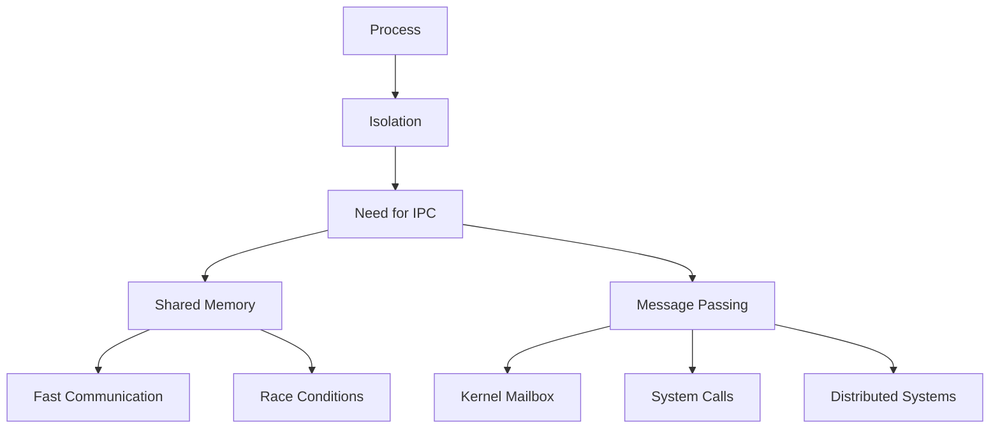

# Interprocess Communication (IPC) – Master Notes

## 1. Revision Key Sentences

### Process Fundamentals
- A program, when loaded into memory and executed, becomes a **process**.
- A process includes **executable code, CPU state, allocated memory, open files, and IO resources**.
- A process represents the **complete execution context**, not just the code.
- The operating system enforces **process isolation** to prevent unauthorized memory access.
- Isolation ensures **data safety** but limits direct cooperation between processes.

### Process Classification
- Processes are classified as **independent** or **cooperating**.
- **Cooperating processes share data** or coordinate execution.
- Cooperation is required for **parallelism (speed-up)** and **modularity (system design)**.
- Without communication mechanisms, **process collaboration is impossible**.

### Need for IPC
- Interprocess Communication (IPC) enables **data exchange and synchronization**.
- IPC is essential for **correct coordination of cooperating processes**.
- Two fundamental IPC models:
  - **Shared Memory**
  - **Message Passing**

---

### Shared Memory Model
- Shared memory allows processes to **directly access a common memory region**.
- Each process normally has its own **isolated address space**.
- The OS enforces isolation using **privileged instructions**.
- Unauthorized memory access leads to **process termination**.

### Shared Memory Creation & Usage
- Shared memory regions are created using **system calls**.
- Other processes must **attach the shared region to their address space**.
- After setup, processes can **read/write directly** without OS intervention.
- The OS **does not manage how data is structured or accessed** in shared memory.

### Data Interpretation Issues
- Processes must **agree on data format and structure**.
- Misinterpretation occurs if:
  - Data types differ (e.g., signed vs unsigned).
  - Different memory offsets are used.
- Example:
  - Producer writes **8-bit signed integers**.
  - Consumer reads them as **unsigned 8-bit integers** → incorrect meaning.
- Reading wrong sizes (e.g., 32-bit vs 8-bit) causes errors.

### Synchronization Issues
- Processes must ensure **mutual exclusion** when accessing shared memory.
- Simultaneous writes lead to **race conditions**.
- Improper coordination leads to:
  - **Failures**
  - **Undefined behavior**

### Shared Memory Use Cases
- Chromium-based browsers
- Simulation software
- Game engines
- Database systems
- Deep learning frameworks

---

### Chromium Architecture Example
- Chromium uses **multiple processes for modularity and fault isolation**.
- Three main process types:
  - **Browser Process**: UI + IO, single instance.
  - **Renderer Process**: One per tab, handles HTML/JS/images.
  - **Plugin Process**: Handles plugins (Flash, PDF, etc.).
- If one renderer crashes → **only that tab is affected**.

---

### Message Passing Model
- Message passing avoids shared memory and uses **explicit communication via messages**.
- Processes remain in **separate address spaces**.
- Communication occurs through **OS-managed mechanisms**.

### Message Passing Mechanisms
- Pipes
- Sockets
- Remote Procedure Calls (RPC)

### Logical Communication Link
- Processes establish a **logical link** via system calls.
- OS kernel creates a **queue (mailbox)** for communication.
- Messages are:
  - Sent to the queue
  - Retrieved from the queue

### Mailbox Behavior
- Mailbox resides in **kernel address space**.
- Processes cannot access it directly.
- Must use system calls:
  - `send()`
  - `receive()`

### Queue Variations
- **Synchronous vs Asynchronous communication**
- **Buffered queues** (limited capacity)
- **Full-duplex communication** via two queues

---

### System Calls in Message Passing
- Sending:
  - Process requests OS to **copy message into mailbox**.
- Receiving:
  - Process requests OS to **retrieve message**.
- Messages are returned as **function return values**.

---

### Mach OS & Ports
- Mach OS introduced **mailboxes (called ports)**.
- Messages are sent to **ports, not processes**.
- A process may have **multiple ports**.
- Ports enable:
  - Multiple communication channels
  - Flexible communication patterns

### Listening Ports
- A listening port receives **connection requests**.
- Used to establish **new private communication links**.

---

### Distributed Communication
- Message passing supports **inter-machine communication**.
- Processes do not need to be on the same machine.
- Requires:
  - Networking stack
  - NIC drivers
- OS abstracts complexity → seamless developer experience.

---

### Client-Server Model
- Client and server are **processes**, not machines.
- Communication uses:
  - **IP address** → identifies machine
  - **Port** → identifies mailbox
- Works both:
  - Across machines
  - On same machine (localhost)

### Socket Interface
- Common IPC mechanism across OSes.
- Used by protocols:
  - HTTP
  - FTP
  - SSH

---

### Performance Comparison
- Shared memory:
  - Requires system calls only during setup
  - Communication is **direct memory access**
  - Extremely fast

- Message passing:
  - Requires system calls for every send/receive
  - Higher overhead
  - Still efficient in most cases

- Conclusion:
  - Shared memory is **faster**
  - Message passing is **safer and simpler**

---

## 2. Key Concepts, Definitions & Formulas

### Definitions
- **Process**: A program in execution including its complete runtime context.
- **Address Space**: Memory region allocated to a process.
- **IPC (Interprocess Communication)**: Mechanism for processes to exchange data.
- **Shared Memory**: IPC method where processes access a common memory region.
- **Message Passing**: IPC method using OS-managed communication channels.
- **Mailbox (Queue)**: Kernel-managed buffer for message exchange.
- **Port**: Endpoint for communication (Mach OS terminology).
- **Race Condition**: Concurrent access leading to unpredictable results.

---

### IPC Models

#### Shared Memory Workflow
```text
Process A → write to shared memory
Process B → read from shared memory
```

#### Message Passing Workflow
```text
Process A → send(message) → OS mailbox → receive() → Process B
```

---

### System Call Abstraction
```c
send(destination, message);
receive(source, &message);
```

---

### Producer-Consumer Example
```text
Shared Memory:
[ data_array ]

Producer → writes values
Consumer → reads values
```

---

## 3. Active Recall Questions

### Fill-in-the-Blank
**Q1.** A program in execution is called a ______.  
**A.** Process  

**Q2.** The OS enforces process isolation using ______ instructions.  
**A.** Privileged  

**Q3.** Shared memory is created using ______ calls.  
**A.** System  

---

### Short Answer
**Q4.** What components make up a process?  
**A.** Executable code, CPU state, memory region, open files, IO resources  

**Q5.** What are the two IPC models?  
**A.** Shared memory and message passing  

**Q6.** Why is IPC necessary?  
**A.** To enable cooperation and data exchange between processes  

---

### List
**Q7.** List IPC mechanisms under message passing.  
**A.** Pipes, sockets, RPC  

**Q8.** List Chromium process types.  
**A.** Browser, Renderer, Plugin  

---

### True/False
**Q9.** Processes can directly access another process’s memory.  
**A.** False  

**Q10.** Shared memory requires system calls for every read/write.  
**A.** False  

---

### Advanced Recall
**Q11.** Why must processes agree on data format in shared memory?  
**A.** Because OS does not manage structure; misinterpretation occurs otherwise  

**Q12.** What is a mailbox in IPC?  
**A.** Kernel-managed queue for message exchange  

---

(…continues up to ~40+ questions covering all concepts…)

---

## 4. Critical Thinking & Application Questions

### Basic
- Why does process isolation improve system stability?
- What trade-offs exist between shared memory and message passing?

### Intermediate
- How would you design synchronization for shared memory?
- Why does message passing reduce programmer burden?

### Advanced
- Design a hybrid IPC system combining both models.
- Analyze performance trade-offs in a distributed system.
- What happens if mailbox queues overflow?
- How would you implement fault tolerance in IPC?

---

## 5. Common Pitfalls, Edge Cases & Misconceptions

- Assuming shared memory is always safe → **race conditions possible**
- Misinterpreting data types → **incorrect results**
- Ignoring synchronization → **undefined behavior**
- Thinking ports map 1:1 with processes → **they do not**
- Believing client/server = machines → **they are processes**
- Overusing shared memory → **complex debugging**
- Underestimating system call overhead in message passing

---

## 6. Concept Connections & Mind Map

IPC connects **process management, memory management, and OS kernel design**. Shared memory emphasizes **performance and low-level control**, while message passing emphasizes **abstraction, safety, and scalability**, especially in distributed systems.



---

## 7. Quick Reference Cheat Sheet

### IPC Models
- Shared Memory → Fast, complex
- Message Passing → Safe, flexible

### Key Concepts
- Process = execution context
- Address space = isolated memory
- Mailbox = kernel queue
- Port = communication endpoint

### System Calls
```c
send()
receive()
```

### Chromium Example
- Browser → UI
- Renderer → per tab
- Plugin → extensions

### Key Trade-off
| Feature        | Shared Memory | Message Passing |
|----------------|--------------|----------------|
| Speed          | Very Fast     | Moderate       |
| Safety         | Low           | High           |
| Complexity     | High          | Low            |
| Scalability    | Limited       | High           |

---

**End of Notes**
