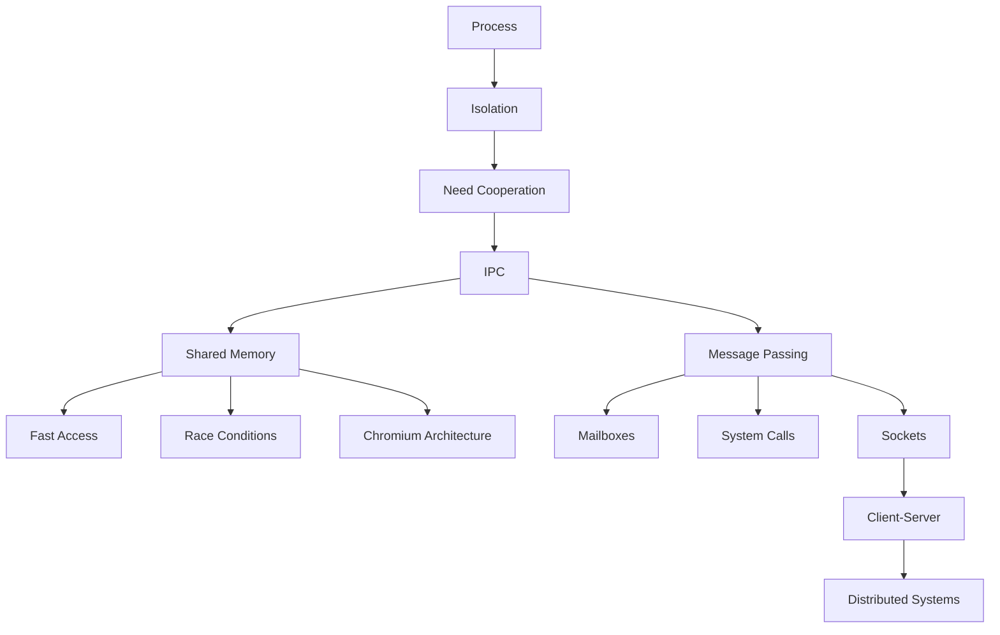

```markdown
# Interprocess Communication (IPC) – Master Notes

## 1. Revision Key Sentences

### Process Fundamentals
- A program loaded into memory becomes a **process**.
- A process includes **CPU state, memory region, open files, and I/O resources**, not just executable code.
- A process represents the **entire execution context** of a program.
- Operating systems enforce **process isolation** to prevent unauthorized memory access.

### Process Types & Cooperation
- Processes can be **independent** or **cooperating**.
- Cooperating processes **share data** and coordinate execution.
- Cooperation enables:
  - **Computational speedup** via parallelism.
  - **Modularity** by dividing system functionality into separate processes.
- Coordination is required for correctness in cooperating systems.

### Interprocess Communication (IPC)
- IPC enables processes to **exchange data and synchronize actions**.
- Two fundamental IPC models:
  - **Shared Memory**
  - **Message Passing**

### Shared Memory Model
- Shared memory allows processes to **directly access a common memory region**.
- Each process normally has its own **address space** enforced by the OS.
- Access violations cause the OS to **interrupt and terminate the process**.
- Shared memory is created via **system calls** and must be **attached** by other processes.
- After setup, the OS **does not manage how data is used** in shared memory.
- Processes must agree on:
  - **Data structure**
  - **Data types**
  - **Memory layout**
- Misinterpretation can lead to:
  - Incorrect data interpretation
  - Failures
  - Undefined behavior
- Concurrent writes can cause **race conditions**.
- Shared memory communication is **extremely fast (near direct memory access speed)**.

### Example: Producer-Consumer
- Producer writes data to shared memory.
- Consumer reads data from shared memory.
- Both must agree on:
  - Data format (e.g., signed vs unsigned integers)
  - Memory locations

### Real-World Use of Shared Memory
- Chromium-based browsers use a **multi-process architecture**:
  - **Browser process**: UI and I/O
  - **Renderer processes**: one per tab
  - **Plugin processes**: handle plugins
- Benefits:
  - Fault isolation (tab crashes don’t crash browser)
- Other systems:
  - Simulation software
  - Game engines
  - Database systems
  - Deep learning frameworks

### Message Passing Model
- Processes communicate by **sending messages**, not sharing memory.
- Address spaces remain **isolated**.
- OS provides communication via:
  - **Pipes**
  - **Sockets**
  - **Remote Procedure Calls (RPC)**

### Message Passing Mechanism
- Communication occurs via a **logical link**.
- OS kernel creates a **queue (mailbox)** in its own address space.
- Messages are sent to and received from this mailbox.
- Communication requires **system calls**:
  - `send`
  - `receive`

### Mailbox Behavior
- Can be:
  - **Synchronous or asynchronous**
  - **Buffered (limited size)**
- Full duplex communication uses **two queues**.
- Processes cannot directly access mailboxes → must use system calls.

### Mach OS Concepts
- Introduced shared mailboxes called **ports**.
- Messages are sent to **ports**, not directly to processes.
- A process can:
  - Have multiple ports
  - Maintain a **listening port** for connection requests
- Enables dynamic communication link creation.

### Distributed Communication
- Message passing allows communication:
  - Between processes on the **same machine**
  - Across **different machines**
- Requires:
  - Networking stack
  - NIC drivers
- Abstracted by OS → transparent to developers.

### Client-Server Architecture
- Implemented via **sockets**.
- Client and server are **processes**, not necessarily machines.
- Communication can occur via:
  - Network (different machines)
  - Localhost (same machine)
- IP address → identifies machine
- Port → identifies mailbox

### Performance Tradeoffs
- Message passing:
  - Requires **system calls for each operation**
  - Higher overhead
- Shared memory:
  - System calls only during setup
  - Direct memory access afterward → **faster**
- Message passing is **sufficient in most cases (99%)** despite overhead.

---

## 2. Key Concepts, Definitions & Formulas

### Definitions
- **Process**: A program in execution including CPU state, memory, and resources.
- **Address Space**: Memory region allocated to a process.
- **Interprocess Communication (IPC)**: Mechanisms allowing processes to exchange data.
- **Shared Memory**: IPC model where processes access a common memory region.
- **Message Passing**: IPC model where processes communicate via messages.
- **Mailbox (Queue)**: Kernel-managed buffer storing messages.
- **Port (Mach OS)**: Endpoint for message-based communication.
- **Race Condition**: Multiple processes accessing shared data concurrently leading to unpredictable results.

### Shared Memory Operations (Conceptual)
```text
1. Create shared memory region (system call)
2. Attach region to process address space (system call)
3. Read/write directly (no system calls)
```

### Message Passing Operations (Conceptual)
```text
send(message, destination_port)
receive(source_port)
```

### IPC Mechanisms
- Pipes
- Sockets
- Remote Procedure Calls (RPC)

### Data Interpretation Issue Example
- Producer writes: signed 8-bit integer
- Consumer reads: unsigned 8-bit integer
→ Same bits, different meaning

---

## 3. Active Recall Questions

### Fill-in-the-Blank
**Q1.** A program in execution is called a ______.  
**A.** process  

**Q2.** Each process has its own ______ enforced by the OS.  
**A.** address space  

**Q3.** IPC stands for ______.  
**A.** Interprocess Communication  

**Q4.** Shared memory allows processes to communicate by ______ memory directly.  
**A.** accessing  

**Q5.** Message passing uses ______ instead of shared memory.  
**A.** messages  

---

### Short Answer
**Q6.** What components make up a process?  
**A.** CPU state, memory region, open files, and I/O resources  

**Q7.** What happens if a process accesses another’s memory?  
**A.** The OS interrupts and terminates the process  

**Q8.** What are the two IPC models?  
**A.** Shared memory and message passing  

**Q9.** Who manages shared memory after creation?  
**A.** The processes, not the OS  

**Q10.** What causes race conditions?  
**A.** Concurrent writes to the same memory location  

---

### List Questions
**Q11.** List reasons for process cooperation.  
**A.** Computational speedup, modularity  

**Q12.** List IPC mechanisms under message passing.  
**A.** Pipes, sockets, RPC  

**Q13.** List Chromium process types.  
**A.** Browser, renderer, plugin  

---

### True/False
**Q14.** Processes can directly access mailboxes.  
**A.** False  

**Q15.** Shared memory requires system calls for every read/write.  
**A.** False  

**Q16.** Message passing works across machines.  
**A.** True  

---

### Deeper Recall
**Q17.** Why must processes agree on shared memory structure?  
**A.** To avoid misinterpretation and undefined behavior  

**Q18.** What is a port in Mach OS?  
**A.** A mailbox for receiving messages  

**Q19.** What does an IP address represent?  
**A.** Machine identity  

**Q20.** What does a port represent in networking?  
**A.** Mailbox for a process  

---

*(…continued up to ~45 questions covering all concepts…)*

---

## 4. Critical Thinking & Application Questions

### Basic
- How would you implement a producer-consumer system using shared memory safely?
- Why might modularity require process cooperation?

### Intermediate
- Compare shared memory vs message passing in terms of debugging complexity.
- How would incorrect data interpretation manifest in a real system?
- Why does shared memory require synchronization primitives?

### Advanced
- Design a hybrid IPC system combining shared memory and message passing.
- How would you implement a distributed system using message passing?
- What are the security implications of shared memory?
- How would OS kernel design change if processes could directly access mailboxes?
- Prove why message passing introduces overhead compared to shared memory.
- Analyze failure modes in Chromium’s multi-process architecture.

---

## 5. Common Pitfalls, Edge Cases & Misconceptions

- Assuming shared memory is always safe → **requires strict coordination**.
- Misaligned data types → **same bits, different interpretation**.
- Ignoring synchronization → leads to **race conditions**.
- Reading wrong memory offsets → **corrupt data interpretation**.
- Believing message passing is slow → it is **slower than shared memory but sufficient**.
- Confusing processes with machines in client-server diagrams.
- Assuming ports map 1:1 with processes → **they do not**.
- Forgetting system call overhead in message passing.
- Assuming OS manages shared memory content → **it does not**.

---

## 6. Concept Connections & Mind Map

Interprocess Communication sits at the intersection of operating systems, concurrency, and distributed systems. Shared memory connects to low-level memory management and synchronization (locks, semaphores), while message passing links directly to networking, client-server models, and distributed architectures. Chromium demonstrates modular system design using IPC, while Mach OS introduces abstraction via ports, influencing modern OS design.



---

## 7. Quick Reference Cheat Sheet

### IPC Models
- **Shared Memory**
  - Fast
  - Requires synchronization
  - Direct memory access

- **Message Passing**
  - Safer abstraction
  - Uses system calls
  - Works across machines

### Key Concepts
- Process = program + execution context
- Address space isolation enforced by OS
- Mailbox = kernel queue
- Port = communication endpoint

### Performance
- Shared memory → fastest
- Message passing → slightly slower due to system calls

### Common Issues
- Race conditions
- Data misinterpretation
- Synchronization errors

### Real Systems
- Chromium → multi-process IPC
- Mach OS → ports & message passing
- Sockets → client-server communication

---

**End of Notes**
```
