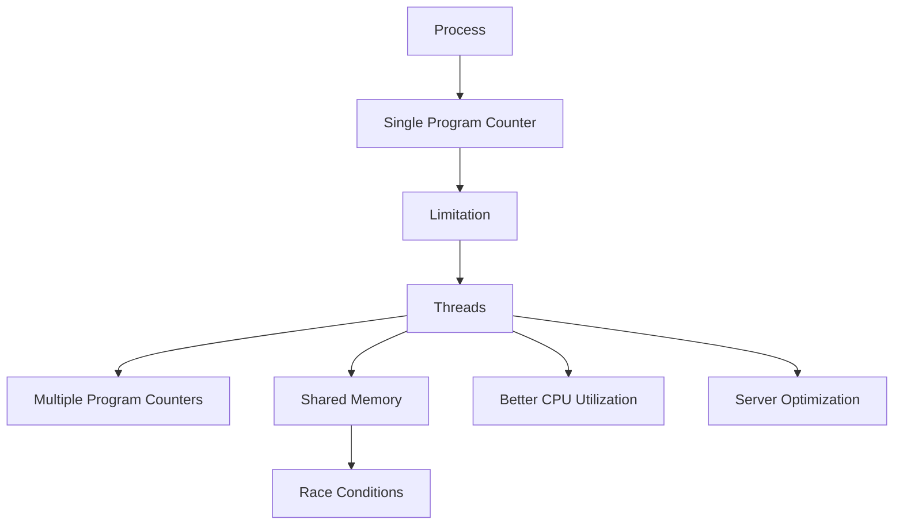

# Threads & Concurrency – Master Notes

## 1. Revision Key Sentences

### Concurrency Fundamentals
- Concurrency is the technique where the operating system **alternates CPU access between multiple processes very rapidly**, creating the illusion of simultaneous execution.
- CPU scheduling is responsible for **deciding which process gets CPU time and when**.
- Concurrency serves two purposes:
  - **Multitasking (illusion of parallel execution)**
  - **Maximizing CPU utilization by filling idle gaps**
- A process does not always use the CPU even when allocated; it may be **waiting for IO operations**.
- Allocating CPU to a process waiting for IO is **inefficient**, so the OS schedules another ready process.
- Concurrency ensures that **CPU idle time is minimized** by switching to runnable tasks.

---

### Limitations of Process-Based Concurrency
- Processes were initially treated as the **smallest schedulable unit of execution**.
- Each process has **one program counter**, tracking its current execution point.
- Because of a single program counter:
  - Only **one execution path per process** can be tracked.
  - Multiple functions inside a process **cannot execute concurrently**.
- Tasks within the same process must execute **sequentially**, causing inefficiency.
- This leads to the **blocking effect**, where one task delays others despite independence.

---

### Need for Intra-Process Concurrency
- Some tasks within the same program are **logically related and tightly coupled**.
- Splitting them into separate processes introduces:
  - **Unnatural design**
  - **IPC complexity**
- Example: Server handling client requests
  - Accept request → read file (IO-heavy) → send response
  - IO operations are **slow compared to CPU operations**
- Sequential processing causes:
  - **Bottlenecks**
  - **Long wait times for later requests**
  - **Idle CPU gaps during IO**

---

### Blocking Effect & Inefficiency
- When one task blocks others despite independence → **blocking effect**
- CPU remains idle during IO → **wasted computational resources**
- Scaling issues:
  - Few requests → manageable
  - Thousands of requests → severe delays

---

### Multi-Process Solution
- Use a **listener process** to accept requests.
- For each request, spawn a **new process**.
- Advantages:
  - Enables concurrency
  - Avoids blocking
- Disadvantages:
  - High **memory usage** (each process has its own address space)
  - Expensive **process creation overhead**
  - Requires **IPC for shared/global state**
  - Poor scalability for thousands of clients

---

### Introduction to Threads
- Threads enable **concurrency within a single process**.
- Instead of one program counter per process:
  - Assign **one program counter per thread**
- Threads are **inner executable entities within a process**.

---

### Thread Structure
Each thread has:
- Its own:
  - Program Counter
  - Register Set
  - CPU State (flags, accumulators, etc.)
  - Stack (with its own stack pointer)
- Shared with other threads:
  - Address Space
  - Heap
  - Code (text section)
  - Global variables

---

### Stack & Memory Behavior
- Each thread must have its **own stack** to avoid overwriting local variables.
- Stacks reside in the **shared process address space**.
- Threads *can* access each other's stacks, but:
  - It is **dangerous and discouraged**
- Heap is preferred for shared data:
  - Less structured
  - Designed for shared access

---

### Synchronization Challenges
- Concurrent access to shared memory can cause:
  - **Race conditions**
  - **Data corruption**
- Synchronization is critical and often supported by:
  - **Hardware-level mechanisms**
- Improper synchronization leads to **undefined behavior**

---

### Threads vs Processes
- Threads are **lighter weight than processes**
- Thread creation is:
  - **Faster**
  - **Less resource-intensive**
- Threads avoid:
  - Separate address spaces
  - Heavy IPC requirements

---

### OS-Level Implementation
- Traditional process control block (PCB) is modified.
- OS may introduce:
  - Separate thread structures OR
  - Unified abstraction (e.g., Linux `task`)
- Linux treats both threads and processes as **tasks**

---

### Main Thread Concept
- Every process has at least **one thread (main thread)**.
- OS schedules execution via **threads, not processes directly**.
- If the main thread terminates:
  - Other threads may also terminate (implementation-dependent)

---

### Thread Creation Model
- Most OSes use **dynamic thread creation**:
  - Process starts single-threaded
  - Threads are created at runtime
- Requires **system calls for thread creation**
- Compile-time thread count is often **unknown**

---

### Thread Behavior & Code Execution
- A thread is **not a function**
- A thread:
  - Does not contain code
  - Points to code via **program counter**
- Multiple threads can execute:
  - The **same function simultaneously**
- Code resides in:
  - **Text section (read-only)**
- Safe for concurrent access because:
  - Code is **never modified**

---

### Low-Level Implementation Insight
- In languages like C:
  - Thread creation requires passing a **function pointer**
- This pointer represents:
  - **Memory address of executable code**

---

### Thread Definitions
- OS Perspective:
  - Thread = **basic unit of execution**
- Developer Perspective:
  - Thread = **mechanism for concurrency within a program**
- Alternative:
  - Thread = **lightweight process**

---

### Server Example with Threads
- Instead of spawning processes:
  - Spawn **one thread per client**
- Benefits:
  - Reduced memory usage
  - Faster creation
  - Better CPU utilization
- Threads handle requests concurrently without blocking

---

### Applicability
- Threads work even on:
  - **Single-core processors**
- Concurrency ≠ Parallelism
- True parallelism requires:
  - **Multiple CPU cores** (covered separately)

---

## 2. Key Concepts, Definitions & Formulas

### Definitions
- **Concurrency**: Rapid switching between tasks to simulate simultaneous execution.
- **Thread**: Smallest unit of execution within a process.
- **Program Counter**: Pointer to the next instruction to execute.
- **Blocking Effect**: When one task delays others unnecessarily.
- **Stack**: Memory for local variables and function calls.
- **Heap**: Memory for dynamic allocation shared across threads.

---

### Thread vs Process

| Feature            | Process                  | Thread                     |
|--------------------|--------------------------|----------------------------|
| Address Space      | Separate                 | Shared                     |
| Creation Cost      | High                     | Low                        |
| Communication      | IPC required             | Direct (shared memory)     |
| Scheduling Unit    | Traditionally process    | Thread (modern OS)         |
| Isolation          | Strong                   | Weak                       |

---

### Execution Model

#### Process-Based
```text
CPU → Process A → Process B → Process C
```

#### Thread-Based
```text
CPU → Thread A1 → Thread A2 → Thread A3 (same process)
```

---

### Server Models

#### Multi-Process
```text
Listener → Spawn Process per Client
```

#### Multi-Threaded
```text
Listener → Spawn Thread per Client
```

---

## 3. Active Recall Questions

### Fill-in-the-Blank
**Q1.** Concurrency creates the illusion of ______ execution.  
**A.** simultaneous  

**Q2.** Each thread has its own ______ and register set.  
**A.** program counter  

**Q3.** Threads share the ______ space of the process.  
**A.** address  

---

### Short Answer
**Q4.** Why is concurrency important beyond multitasking?  
**A.** It maximizes CPU utilization by filling idle gaps  

**Q5.** Why can't two functions run concurrently in a single process traditionally?  
**A.** Because there is only one program counter  

---

### List
**Q6.** What does each thread have independently?  
**A.** Program counter, registers, stack, CPU state  

**Q7.** What is shared among threads?  
**A.** Address space, heap, code  

---

### True/False
**Q8.** Threads have separate address spaces.  
**A.** False  

**Q9.** Code execution by multiple threads is unsafe.  
**A.** False  

---

### Advanced Recall
**Q10.** Why is thread creation faster than process creation?  
**A.** Threads do not require separate address space allocation  

**Q11.** Why is synchronization needed in threads?  
**A.** To prevent race conditions during shared memory access  

---

(…continues to 40+ covering all details…)

---

## 4. Critical Thinking & Application Questions

### Basic
- Why is concurrency necessary even on single-core systems?
- What inefficiencies arise from IO-bound processes?

### Intermediate
- Compare multi-process vs multi-thread server design.
- How would you prevent race conditions in shared memory?

### Advanced
- Design a thread-safe server architecture.
- Analyze trade-offs between thread safety and performance.
- What happens if multiple threads share the same stack?
- How would you debug synchronization issues?

---

## 5. Common Pitfalls, Edge Cases & Misconceptions

- Thinking threads are functions → **they are execution contexts**
- Sharing stacks → **data corruption risk**
- Ignoring synchronization → **race conditions**
- Assuming concurrency = parallelism → **not always true**
- Overusing threads → **context switching overhead**
- Accessing other thread stacks → **unsafe practice**
- Assuming thread termination independence → **main thread may kill all**

---

## 6. Concept Connections & Mind Map

Threads extend process-based systems by enabling **fine-grained concurrency**, improving **CPU utilization**, and reducing **resource overhead**, while introducing **synchronization complexity**.



---

## 7. Quick Reference Cheat Sheet

### Key Ideas
- Thread = lightweight execution unit
- Each thread:
  - Own PC, registers, stack
- Shared:
  - Heap, code, address space

### When to Use Threads
- IO-bound workloads
- High concurrency systems
- Servers

### Risks
- Race conditions
- Synchronization complexity

### Benefits
- Faster than processes
- Lower memory usage
- Better CPU utilization

---

**End of Notes**
